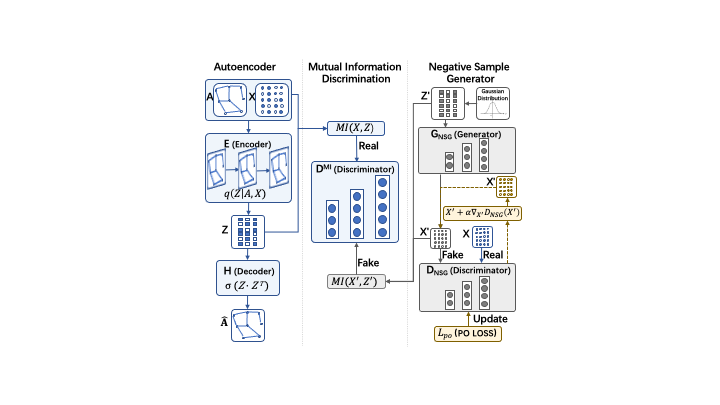

# PAGAE: Improving Graph Autoencoder by Dual Enhanced Adversary"

https://www.researchgate.net/profile/Gongju-Wang/publication/375596500_PAGAE_Improving_Graph_Autoencoder_by_Dual_Enhanced_Adversary/links/6551947cb1398a779d7f4bd6/PAGAE-Improving-Graph-Autoencoder-by-Dual-Enhanced-Adversary.pdf



## Citation
```
@inproceedings{wang2023pagae,
  title={PAGAE: Improving Graph Autoencoder by Dual Enhanced Adversary.},
  author={Wang, Gongju and Li, Mengyao and Feng, Hanbin and Yan, Long and Song, Yulun and Li, Yang and Song, Yinghao},
  booktitle={CogSci},
  year={2023}
}
```

## Overview
Here we provide an implementation of PAGAE/PAGAEpo in PyTorch, along with a minimal execution example (on the Cora dataset). The repository is organised as follows:
- `data/` contains the necessary dataset files;
- `results/` contains the embedding results;
- `layers.py` contains the implementation of a GCN layer;
- `utils.py` contains the necessary processing function.
- `model.py` contains the implementation of a GAE model, discriminator model and mutual information estimator model.
- `optimizer.py` contains the implementation of the reconstruction loss.

