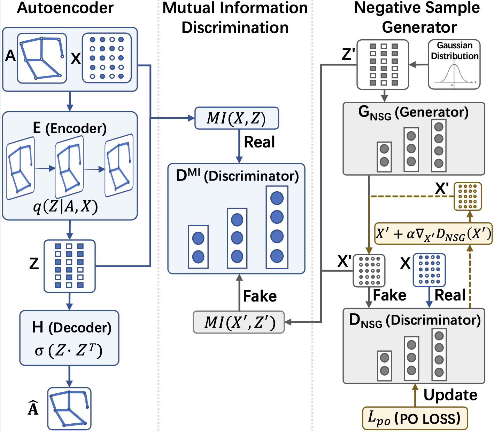

# PAGAE: Improving Graph Autoencoder by Dual Enhanced Adversary (CogSci 2023)

## PAGAE:

PAGAE is the code for our paper "PAGAE: Improving Graph Autoencoder by Dual Enhanced Adversary", which is published in CogSci 2023. 



## Citation
```
@inproceedings{wang2023pagae,
  title={PAGAE: Improving Graph Autoencoder by Dual Enhanced Adversary.},
  author={Wang, Gongju and Li, Mengyao and Feng, Hanbin and Yan, Long and Song, Yulun and Li, Yang and Song, Yinghao},
  booktitle={CogSci},
  year={2023}
}
```

## Data

In this example, we load citation network data (Cora, Citeseer or Pubmed). The original datasets can be found here: http://linqs.cs.umd.edu/projects/projects/lbc/ and here (in a different format): https://github.com/kimiyoung/planetoid

## Models

## Overview
Here we provide an implementation of PAGAE/PAGAEpo in PyTorch, along with a minimal execution example (on the Cora dataset). The repository is organised as follows:
- `data/` contains the necessary dataset files;
- `results/` contains the embedding results;
- `layers.py` contains the implementation of a GCN layer;
- `utils.py` contains the necessary processing function.
- `model.py` contains the implementation of a GAE model, discriminator model and mutual information estimator model.
- `optimizer.py` contains the implementation of the reconstruction loss.

